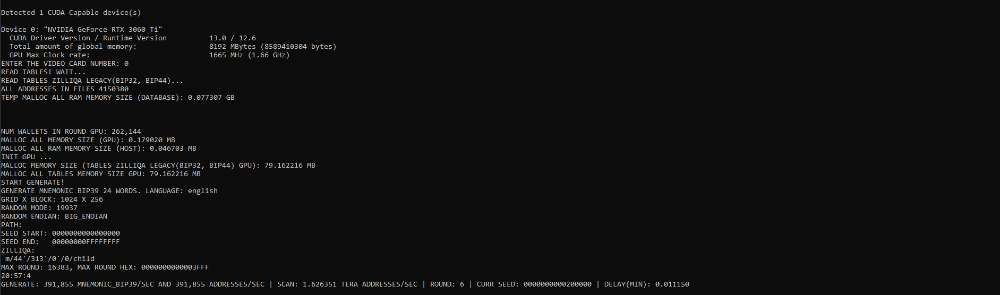
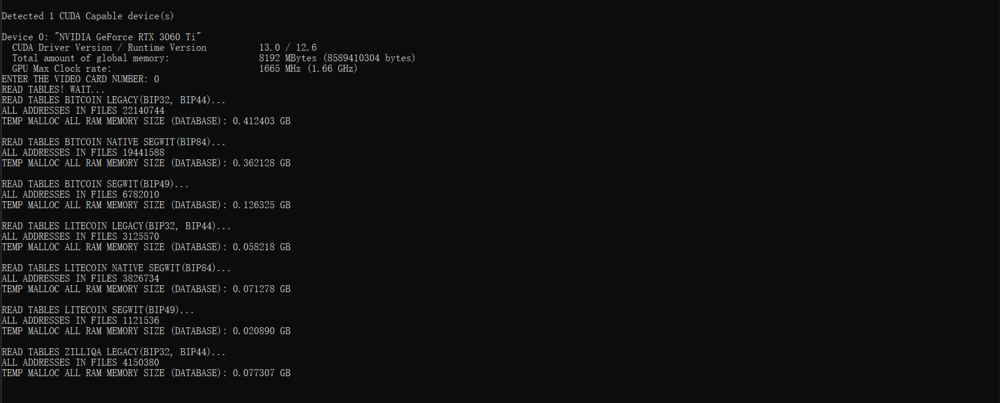
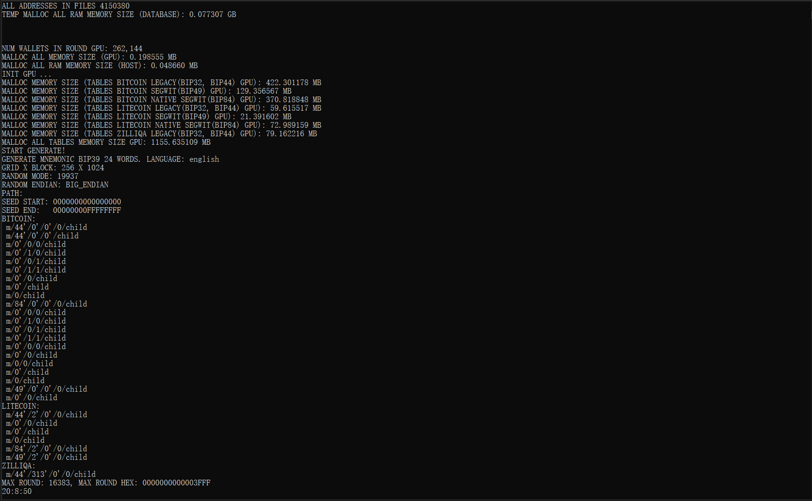

# Brute-force Mnemonic on GPU(CUDA)
## (Version 1.0)
## Generating mnemonic phrases and corresponding private key addresses. Searching for addresses in the database.


# Mnemonic and Private Key Generation Program

A program for generating mnemonic phrases and private key addresses for various cryptocurrencies with support for custom patches.

## Main Features

### 🔧 Coin Generation
- Enable/disable generation for various cryptocurrencies
- Support for custom patches with depth from 0 to 4,294,967,295

### 🔐 Address Types
- Generation of compressed and uncompressed addresses
- Support for various output formats

### 🎲 Random Number Generators
- Selection of various 32-bit and 64-bit RNGs
- Support for generators:
  - **19937** (compromised TrustWallet and other wallets. Trust Wallet, a popular mobile cryptocurrency wallet, used the 19937 random number generator to create mnemonic phrases and private keys.)
  - **MRPT**
  - **SRAND**
  - **RAND_GNU**
  - **RAND_MSVC**
  - **RAND_CHROMIUM**
  - **CHROME_SRANDOM**

### ⚙️ Operation Modes
- Sequential switching of RNG generators
- Brute-forcing seed values from `start_seed_random` to `end_seed_random`
- Support for **BIG_ENDIAN** and **LITTLE_ENDIAN** modes
- Generation of mnemonics with variable word count

## 🚀 Key Features

### 1. GPU Optimization
- Address databases are loaded into GPU memory
- Matching is performed on the GPU for maximum speed

### 2. GPU Generation
- All RNG generators run on the GPU
- Entropy is generated directly on the graphics processor

### 3. Generator Flexibility
- Support for 32-bit and 64-bit generators
- Customization of generator sequences

## 🎯 Practical Applications

### Educational Purposes
```json
  "RANDOM_MODE": ["19937", "MRPT", "SRAND"],
  ...
  "start_seed_random": "0",
  "end_seed_random": "FFFFFFFF"
```
- Fast brute-forcing of all mnemonic combinations
- Analysis of vulnerabilities in compromised wallets (TrustWallet, etc.)

### Wallet Recovery
```json
  "RANDOM_MODE": ["119937_64BIT"],
  ...
  "start_seed_random": "0",
  "end_seed_random": "FFFFFFFFFFFFFFFF"
```
- Recovery of forgotten wallets using 64-bit generators

## 📚 Additional Information

More detailed description of known vulnerabilities and protection methods is available on our website.

---

**Note**: This program is intended for educational and research purposes only. Use responsibly.

</br></br></br></br>
# config.cfg File
</br></br>
***
***
***
***
***
***
```python
  //-------------------------------------------------------------------
  //-------------------------------------------------------------------
  //-------------------------------------------------------------------
  "BITCOIN": {
    "GENERATE": "yes",
    "folder_table": {
      "legacy": "E:\\tables_2025\\bitcoin_legacy",
      "segwit": "E:\\tables_2025\\bitcoin_segwit",
      "native_segwit": "E:\\tables_2025\\bitcoin_native_segwit"
    },
    "address": {
      "legacy": {
        "path": [
          "m/44'/0'/0'/0/child",
          "m/44'/0'/0'/child",
          "m/0'/0/0/child",
          "m/0'/1/0/child",
          "m/0'/0/1/child",
          "m/0'/1/1/child",
          "m/0'/0/child",
          "m/0'/child",
          "m/0/child"
        ],
        "type": {
          "compressed_legacy": "yes",
          "uncompressed_legacy": "yes"
        }
      },
      "segwit": {
        "path": [
          "m/49'/0'/0'/0/child",
          "m/0'/0/child"
        ],
        "type": {
          "compressed_segwit": "yes"
        }
      },
      "native_segwit": {
        "path": [
          "m/84'/0'/0'/0/child",
          "m/0'/0/0/child",
          "m/0'/1/0/child",
          "m/0'/0/1/child",
          "m/0'/1/1/child",
          "m/0'/0/0/child",
          "m/0'/0/child",
          "m/0/0/child",
          "m/0'/child",
          "m/0/child"
        ],
        "type": {
          "compressed_native_segwit": "yes",
          "uncompressed_native_segwit": "yes"
        }
      }
    }
  }
```

* ***"BITCOIN": {*** - coin name ("ETHEREUM","BITCOIN","LITECOIN","BITCOINCASH","DASH","DOGECOIN","ZCASH","TRON","ZILLIQA","BITCOINGOLD","DIGIBYTE","KASPA","GROESTLCOIN")
* ***"GENERATE": "yes",*** - enable generation for this coin
* ***"folder_table": {***</br>
      ***""legacy": "E:\\tables_2025\\3_5_bin\\bitcoin_legacy",***</br>
      ***""segwit": "E:\\tables_2025\\3_5_bin\\bitcoin_segwit",***</br>
      ***""native_segwit": "E:\\tables_2025\\3_5_bin\\bitcoin_native_segwit"***</br>
    ***"},*** - path to the folder with target address tables. For legacy (bitcoin addresses starting with 1), segwit (bitcoin addresses starting with 3) and native segwit (bitcoin addresses starting with bc1) addresses. Addresses in tables must be in hash160 format, in byte representation, and sorted by the program https://github.com/Houzich/Convert-Addresses-To-Hash160-For-Brute-Force
* ***"path": [***</br>
          ***"m/49'/0'/0'/0/child",***</br>
          ***"m/0'/0/child'"***</br>
        ***],*** - list of address patches. child or child' - the last patch number equal to 0. Can be incremented by the value set in num_child_addresses. For example, if num_child_addresses = 3, addresses with patches will be generated: m/49'/0'/0'/0/0, m/49'/0'/0'/0/1, m/49'/0'/0'/0/2, m/0'/0/0', m/0'/0/1', m/0'/0/2'.
* ***"type": {***
          ***"compressed_legacy": "yes",***
          ***"uncompressed_legacy": "yes"***
        ***}*** - generate compressed and uncompressed addresses. If set to "no", this address type will not be generated</br></br>
In this case: </br>
BITCOIN address generation is enabled (*"GENERATE": "yes"*). Legacy, segwit and native segwit addresses will be generated and searched in tables loaded from folders "E:\\tables_2025\\bitcoin_legacy", "segwit": "E:\\tables_2025\\bitcoin_segwit", "E:\\tables_2025\\bitcoin_native_segwit" respectively. Will be generated: Compressed (*"compressed_legacy": "yes"*) and uncompressed (*"uncompressed_legacy": "yes"*) addresses for patches m/44'/0'/0'/0/0, m/44'/0'/0'/0, m/0'/0/0/0, m/0'/1/0/0, m/0'/0/1/0, m/0'/1/1/0, m/0'/0/0, m/0'/0, m/0/0. Compressed (*"compressed_segwit": "yes"*) addresses for patches m/49'/0'/0'/0/0, m/0'/0/0. Compressed (*"compressed_native_segwit": "yes"*) and uncompressed (*"uncompressed_native_segwit": "yes"*) addresses for patches m/84'/0'/0'/0/0, m/0'/0/0/0, m/0'/1/0/0, m/0'/0/1/0, m/0'/1/1/0, m/0'/0/0/0, m/0'/0/0, m/0/0/0, m/0'/0, m/0/0.

</br></br>
***
***
***
***
***
***

```python
    "SECRET": [
      "MNEMONIC_BIP39"
    ],
```

*"MNEMONIC_BIP39"* - Generate BIP39 mnemonic</br>
*"MNEMONIC_ELECTRUM_SEGWIT"* - Generate Electrum segwit mnemonic for Bitcoin. Uses settings from the "ELECTRUM" block</br>
*"MNEMONIC_ELECTRUM_OLD"* - Generate Electrum old mnemonic for Bitcoin. Uses settings from the "ELECTRUM" block

</br></br>
***
***
***
***
***
***


```python
    "RANDOM_MODE": [
      "19937",
      "MRPT",
      "19937_MRPT_64",
    ],
```

 

Selection of random number generator for mnemonic entropy generation. Uses all known RNGs with vulnerabilities and others. Multiple can be specified, then generation will occur sequentially.</br>
Random number generators:</br>
* *"19937", "19937_64BIT", "MRPT", "MRPT_64BIT", "BX_19937", "BX_19937_64BIT", "BX_MRPT", "BX_MRPT_64BIT", "PCG_19937", "PCG_MRPT", "APPLE_SRANDOM_19937", "APPLE_SRANDOM_MRPT", "APPLE_INITSTATE_19937", "APPLE_INITSTATE_MRPT",*</br>
* *"RAND_GNU", "RAND_MSVC", "RAND_CHRONIUM", "CMWC_CHRONIUM", "CMWC_MSVC", "PNG_DART", "SRAND", "BX_SRAND", "CHROME_SRANDOM", "CHROME_INITSTATE", "BX_CHROME_SRANDOM", "BX_CHROME_INITSTATE",*</br>
* *"APPLE_SRAND_16BIT", "APPLE_SRAND_8BIT", "RAND_STORM", "BX_RAND_STORM", "JS_RANDSTORM",*</br>
* *"BX_64_19937", "BX_128_19937", "BX_192_19937", "BX_256_19937", "BX_320_19937", "BX_384_19937", "BX_448_19937", "BX_512_19937",*</br>
* *"BX_64_MRPT", "BX_128_MRPT", "BX_192_MRPT", "BX_256_MRPT", "BX_320_MRPT", "BX_384_MRPT", "BX_448_MRPT", "BX_512_MRPT",*</br>
* *"BX_64_GNU", "BX_128_GNU", "BX_192_GNU", "BX_256_GNU", "BX_320_GNU", "BX_384_GNU", "BX_448_GNU", "BX_512_GNU",*</br>
* *"PCG_GNU_1", "PCG_GNU_2"*

</br></br>
***
***
***
***
***
***

```python
    "RANDOM_ENDIAN": [
      "BIG_ENDIAN",
      "LITTLE_ENDIAN"
    ],
```
Selection of byte representation (ordering) for mnemonic entropy. Big Endian (Most significant byte at lowest address, "from larger to smaller"), Little Endian (Least significant byte at lowest address, "from smaller to larger").


</br></br>
***
***
***
***
***
***

```python
    "LANGUAGE": [
      "english"
      "spanish",
      "italian",
      "french",
      "chinese_simplified",
      "chinese_traditional",
      "portuguese",
      "japanese",
      "korean",
      "czech"
    ],
``` 
Mnemonic language

</br></br>
***
***
***
***
***
***

```python
    "NUM_WORDS_MNEMONIC": [
      3,
      6,
      9,
      12,
      15,
      18,
      21,
      24,
    ]
``` 
Number of words in the mnemonic

</br></br>
***
***
***
***
***
***

* ***"start_seed_random": "0"*** - initial seed number for RNG in HEX format
* ***"end_seed_random": "FFFFFFFF"*** - final seed number for RNG in HEX format. Generation will continue up to this number. Total number of generated mnemonics equals end_seed_random - start_seed_random. Maximum value: FFFFFFFFFFFFFFFF (uint64 max)

* ***"num_child_addresses": 10*** - number of addresses generated for each patch. From 1 to 65,535.</br></br>

* ***"cuda_grid": 1024*** - GPU configuration
* ***"cuda_block": 256*** - GPU configuration
Number of mnemonics generated per round equals cuda_grid*cuda_block


# Program Operation
When the program starts, it reads settings from the config.cfg file.
The console displays:
> *Detected 3 CUDA Capable device(s)*

where the number 3 is the number of found NVIDIA graphics cards.
Then the characteristics of each card are displayed:
> *Device 0: "NVIDIA GeForce GTX 1050 Ti"*</br>
> *...*</br>
> Device 1: "NVIDIA GeForce GTX 1050 Ti"</br>
> *...*</br>
> *Device 2: "NVIDIA GeForce GTX 1050 Ti"*</br>
> *Enter the number of the used video card:*</br>

You need to enter the number of the card to use.</br>

Reading and conversion of address table files begins:


Then information about memory usage, settings and generation mode is displayed:


And the generation process begins.
During program operation, the message is constantly updated:

> *GENERATE: 3,302 MNEMONICS/SEC AND 66,049 ADDRESSES/SEC | SCAN: 5.949203 TERA ADDRESSES/SEC | ROUND: 11*

Number of mnemonics and number of addresses generated per second and total number of addresses scanned in tables. In this case, 20 addresses were generated for each generated wallet. 10 addresses for patch m/44'/60'/0'/0/x and 10 addresses for patch m/44'/60'/0'/1/x

# If a wallet is found
The console will display:
> *!!!FOUND!!!*</br>
> *!!!FOUND ADDRESS (m/44'/60'/0'/0/3): potato toe drift abuse trip garbage crouch satoshi state siren poem opera, 0xE0D05B513E6324EC9E3474087598AA7EAE352919*</br>
> *!!!FOUND!!*

The mnemonic and address we found. And the information will be added to the Found_Addresses.csv file.
Lines in the file are stored as:</br>
> *once crawl mammal mutual weekend quit uphold churn off broken athlete knee,address path ETHEREUM m/44'/60'/0'/0/0,privat key FAEF3C09B1DAF615A6794983FA915B2E5C2F02CF5B3037BF9E39A38A7468E672,0xC7DC56AB7C50C6793BEA85E18C95B4BFB789A1DE,round 3,Mon Aug  5 08:28:07 2024*
>
</br></br></br></br>
# Found_Mnemonics.csv file
File with found mnemonics generated by various random number generators (RNG) using the CUDA-GPU-Brute-Force-Mnemonic program
</br></br>
</br></br></br>
# Program for Windows. The package consists of an exe file, configuration file and instructions. Price $400.
## To purchase, contact Telegram: @Sturman_1
### CODE DISCUSSION: https://t.me/BRUTE_FORCE_CRYPTO_WALLET


## If you want to support the project don't hesitate to donate.
**BTC** - bc1qqldn5lyk54rcvf5ndruh525v0qz8lf9yu5t9a5</br>
**ETH** - 0x1193901D25604F55f5fA93Be09F5203b4B6F265f


</br></br></br></br>
***
***
***
***
***
***
***
***
***
***
***
***
***
***
***
***
***
***
***
***
***
***
</br></br></br></br>

# Brute-force Mnemonic on GPU(CUDA)
## (Version 1.0)
## Генерация мнемонических фраз и соответствующих приватных ключей адресов. Поиск адресов в базе.


# Программа генерации мнемоник и приватных ключей

Программа для генерации мнемонических фраз и приватных ключей адресов различных криптовалют с поддержкой пользовательских патчей.

## Основные функции

### 🔧 Генерация монет
- Включение/отключение генерации для различных криптовалют
- Поддержка пользовательских патчей с глубиной от 0 до 4,294,967,295

### 🔐 Типы адресов
- Генерация compressed и uncompressed адресов
- Поддержка различных форматов вывода

### 🎲 Генераторы случайных чисел
- Выбор из различных 32-битных и 64-битных ГСЧ
- Поддержка генераторов: 
  - **19937** (взлом TrustWallet и других кошельков. Trust Wallet, популярный мобильный кошелек для криптовалют, использовал генератор случайных чисел 19937 для создания мнемонических фраз и приватных ключей.)
  - **MRPT**
  - **SRAND**
  - **RAND_GNU**
  - **RAND_MSVC**
  - **RAND_CHROMIUM**
  - **CHROME_SRANDOM**

### ⚙️ Режимы работы
- Последовательная смена генераторов ГСЧ
- Перебор seed значений от `start_seed_random` до `end_seed_random`
- Поддержка режимов **BIG_ENDIAN** и **LITTLE_ENDIAN**
- Генерация мнемоник с переменным количеством слов

## 🚀 Ключевые особенности

### 1. GPU-оптимизация
- Базы адресов загружаются в память GPU
- Поиск совпадений выполняется на GPU для максимальной скорости

### 2. Генерация на GPU
- Все генераторы ГСЧ работают на GPU
- Энтропия генерируется непосредственно на графическом процессоре

### 3. Гибкость генераторов
- Поддержка 32-битных и 64-битных генераторов
- Возможность кастомизации последовательности генераторов

## 🎯 Практическое применение

### Обучающие цели
```json
  "RANDOM_MODE": ["19937", "MRPT", "SRAND"],
  ...
  "start_seed_random": "0",
  "end_seed_random": "FFFFFFFF"
```
- Быстрый перебор всех комбинаций мнемоник
- Анализ уязвимостей взломанных кошельков (TrustWallet и др.)

### Поиск кошельков
```json
  "RANDOM_MODE": ["119937_64BIT"],
  ...
  "start_seed_random": "0",
  "end_seed_random": "FFFFFFFFFFFFFFFF"
```
- Поиск забытых кошельков с помощью 64-битных генераторов

## 📚 Дополнительная информация

Более подробное описание известных уязвимостей и методов защиты доступно на нашем сайте.

---

**Примечание**: Программа предназначена для образовательных и исследовательских целей. Используйте responsibly.

</br></br></br></br>
# Файл config.cfg
</br></br>
***
***
***
***
***
***
```python
  //-------------------------------------------------------------------
  //-------------------------------------------------------------------
  //-------------------------------------------------------------------
  "BITCOIN": {
    "GENERATE": "yes",
    "folder_table": {
      "legacy": "E:\\tables_2025\\bitcoin_legacy",
      "segwit": "E:\\tables_2025\\bitcoin_segwit",
      "native_segwit": "E:\\tables_2025\\bitcoin_native_segwit"
    },
    "address": {
      "legacy": {
        "path": [
          "m/44'/0'/0'/0/child",
          "m/44'/0'/0'/child",
          "m/0'/0/0/child",
          "m/0'/1/0/child",
          "m/0'/0/1/child",
          "m/0'/1/1/child",
          "m/0'/0/child",
          "m/0'/child",
          "m/0/child"
        ],
        "type": {
          "compressed_legacy": "yes",
          "uncompressed_legacy": "yes"
        }
      },
      "segwit": {
        "path": [
          "m/49'/0'/0'/0/child",
          "m/0'/0/child"
        ],
        "type": {
          "compressed_segwit": "yes"
        }
      },
      "native_segwit": {
        "path": [
          "m/84'/0'/0'/0/child",
          "m/0'/0/0/child",
          "m/0'/1/0/child",
          "m/0'/0/1/child",
          "m/0'/1/1/child",
          "m/0'/0/0/child",
          "m/0'/0/child",
          "m/0/0/child",
          "m/0'/child",
          "m/0/child"
        ],
        "type": {
          "compressed_native_segwit": "yes",
          "uncompressed_native_segwit": "yes"
        }
      }
    }
  }
```

* ***"BITCOIN": {*** - название монеты ("ETHEREUM","BITCOIN","LITECOIN","BITCOINCASH","DASH","DOGECOIN","ZCASH","TRON","ZILLIQA","BITCOINGOLD","DIGIBYTE","KASPA","GROESTLCOIN")
* ***"GENERATE": "yes",*** - включение генерации данной монеты
* ***"folder_table": {***</br>
      ***""legacy": "E:\\tables_2025\\3_5_bin\\bitcoin_legacy",***</br>
      ***""segwit": "E:\\tables_2025\\3_5_bin\\bitcoin_segwit",***</br>
      ***""native_segwit": "E:\\tables_2025\\3_5_bin\\bitcoin_native_segwit"***</br>
    ***"},*** - путь к папке с таблицами искомых адресов. Для legacy(для bitcoin начинаются на 1), segwit(для bitcoin начинаются на 3) и native segwit(для bitcoin начинаются на bc1) адресов. Адреса в таблицах должны быть в формате hash160, в байтовом представлении, и отсортированы программой https://github.com/Houzich/Convert-Addresses-To-Hash160-For-Brute-Force
* ***"path": [***</br>
          ***"m/49'/0'/0'/0/child",***</br>
          ***"m/0'/0/child'"***</br>
        ***],*** - список патчей адресов. child или child' - последний номер патча равный 0. Может инкременироваться на значение которое задается в num_child_addresses. К примеру, если num_child_addresses = 3, то будут генерироваться адреса с патчами: m/49'/0'/0'/0/0, m/49'/0'/0'/0/1, m/49'/0'/0'/0/2, m/0'/0/0', m/0'/0/1', m/0'/0/2'.
* ***"type": {***
          ***"compressed_legacy": "yes",***
          ***"uncompressed_legacy": "yes"***
        ***}*** - генерировать адреса compressed и uncompressed. Если установить в "no", данный тип адресов не будет генерироваться</br></br>
В данном случае: </br>
Разрешина генерация адресов BITCOIN (*"GENERATE": "yes"*). Будут генерироваться адреса legacy, segwit и native segwit и производиться поиск в таблицах, которые будут загружаться из папок "E:\\tables_2025\\bitcoin_legacy", "segwit": "E:\\tables_2025\\bitcoin_segwit", "E:\\tables_2025\\bitcoin_native_segwit" соответственно. Будут генерироваться: Адреса compressed(*"compressed_legacy": "yes"*) и uncompressed(*"uncompressed_legacy": "yes"*) для патчей m/44'/0'/0'/0/0, m/44'/0'/0'/0, m/0'/0/0/0, m/0'/1/0/0, m/0'/0/1/0, m/0'/1/1/0, m/0'/0/0, m/0'/0, m/0/0. Адреса compressed(*"compressed_segwit": "yes"*) для патчей m/49'/0'/0'/0/0, m/0'/0/0. Адреса compressed(*"compressed_native_segwit": "yes"*) и uncompressed(*"uncompressed_native_segwit": "yes"*) для патчей m/84'/0'/0'/0/0, m/0'/0/0/0, m/0'/1/0/0, m/0'/0/1/0, m/0'/1/1/0, m/0'/0/0/0, m/0'/0/0, m/0/0/0, m/0'/0, m/0/0. 

</br></br>
***
***
***
***
***
***

```python
    "SECRET": [
      "MNEMONIC_BIP39"
    ],
```

*"MNEMONIC_BIP39"* - Генерация мнемоники BIP39</br>
*"MNEMONIC_ELECTRUM_SEGWIT"* - Генерация мнемоники Electrun segwit для Bitcoin. Используются натсройки из блока "ELECTRUM"</br>
*"MNEMONIC_ELECTRUM_OLD"* - Генерация мнемоники Electrun old для Bitcoin. Используются натсройки из блока "ELECTRUM"

</br></br>
***
***
***
***
***
***


```python
    "RANDOM_MODE": [
      "19937",
      "MRPT",
      "19937_MRPT_64",
    ],
```

 

Выбор генератора случайных чисел для генерации энтропии мнемоники. Используются все известные ГСЧ с уязвимостями и д.р. Можно задавать несколько, тогда генерация будет просиходить последовательно.</br>
Генераторы случайных чисел:</br>
* *"19937", "19937_64BIT", "MRPT", "MRPT_64BIT", "BX_19937", "BX_19937_64BIT", "BX_MRPT", "BX_MRPT_64BIT", "PCG_19937", "PCG_MRPT", "APPLE_SRANDOM_19937", "APPLE_SRANDOM_MRPT", "APPLE_INITSTATE_19937", "APPLE_INITSTATE_MRPT",*</br>
* *"RAND_GNU", "RAND_MSVC", "RAND_CHRONIUM", "CMWC_CHRONIUM", "CMWC_MSVC", "PNG_DART", "SRAND", "BX_SRAND", "CHROME_SRANDOM", "CHROME_INITSTATE", "BX_CHROME_SRANDOM", "BX_CHROME_INITSTATE",*</br>
* *"APPLE_SRAND_16BIT", "APPLE_SRAND_8BIT", "RAND_STORM", "BX_RAND_STORM", "JS_RANDSTORM",*</br>
* *"BX_64_19937", "BX_128_19937", "BX_192_19937", "BX_256_19937", "BX_320_19937", "BX_384_19937", "BX_448_19937", "BX_512_19937",*</br>
* *"BX_64_MRPT", "BX_128_MRPT", "BX_192_MRPT", "BX_256_MRPT", "BX_320_MRPT", "BX_384_MRPT", "BX_448_MRPT", "BX_512_MRPT",*</br>
* *"BX_64_GNU", "BX_128_GNU", "BX_192_GNU", "BX_256_GNU", "BX_320_GNU", "BX_384_GNU", "BX_448_GNU", "BX_512_GNU",*</br>
* *"PCG_GNU_1", "PCG_GNU_2"*

</br></br>
***
***
***
***
***
***

```python
    "RANDOM_ENDIAN": [
      "BIG_ENDIAN",
      "LITTLE_ENDIAN"
    ],
```
Выбор способа представления (упорядочивания) байтов энтропии для мнемоники. Big Endian (Старший байт по младшему адресу, "от большего к меньшему"), Little Endian (Младший байт по младшему адресу, "от меньшего к большему").

</br></br>
***
***
***
***
***
***

```python
    "LANGUAGE": [
      "english"
      "spanish",
      "italian",
      "french",
      "chinese_simplified",
      "chinese_traditional",
      "portuguese",
      "japanese",
      "korean",
      "czech"
    ],
``` 
Язык мнемоники

</br></br>
***
***
***
***
***
***

```python
    "NUM_WORDS_MNEMONIC": [
      3,
      6,
      9,
      12,
      15,
      18,
      21,
      24,
    ]
``` 
Количество слов в мнемонике

</br></br>
***
***
***
***
***
***

* ***"start_seed_random": "0"*** - начальное seed число для ГСЧ в формате HEX
* ***"end_seed_random": "FFFFFFFF"*** - конечное seed число для ГСЧ в формате HEX. До этого числа будет продолжаться генерация. Общеее кол-во сгенерированных мнемник равно end_seed_random - start_seed_random. Максимальное значение: FFFFFFFFFFFFFFFF (uint64 max)

* ***"num_child_addresses": 10*** - количество генерируемых адресов для каждого патча. От 1 до 65,535.</br></br>

* ***"cuda_grid": 1024*** - настройка под видеокарту
* ***"cuda_block": 256*** - настройка под видеокарту
Кол-во генерируемых мнемоник за раунд равно cuda_grid*cuda_block


# Работа программы
При запуске программы, считываются настройки из файла config.cfg.
В консоли выводится надпись
> *Detected 3 CUDA Capable device(s)*

где число 3  - это количество найденных видеокарт NVIDIA.
Далее выводятся характеристики каждой карты:
> *Device 0: "NVIDIA GeForce GTX 1050 Ti"*</br>
> *...*</br>
> Device 1: "NVIDIA GeForce GTX 1050 Ti"</br>
> *...*</br>
> *Device 2: "NVIDIA GeForce GTX 1050 Ti"*</br>
> *Enter the number of the used video card:*</br>

Нужно ввести номер используемой карты.</br>

Начинается считывание и преобразование файлов таблиц с адресами:


Далее выводиться информация о объемах занимаемой памяти, настройках и режиме генерации:


И начинается процесс генерации.
В ходе работы программы, постоянно обновляется надпись

> *GENERATE: 3,302 MNEMONICS/SEC AND 66,049 ADDRESSES/SEC | SCAN: 5.949203 TERA ADDRESSES/SEC | ROUND: 11*

Кол-во мнемоник и кол-во адресов генерируемых за секунду и общее кол-во отсканированных адресов в таблицах. В данном случае, для каждого сгенерированного кошелька генерировалось 20 адресов. 10 адресов патча m/44'/60'/0'/0/x и 10 адресов патча m/44'/60'/0'/1/x

# Если нашли кошелек
В консоли появиться надписи:
> *!!!FOUND!!!*</br>
> *!!!FOUND ADDRESS (m/44'/60'/0'/0/3): potato toe drift abuse trip garbage crouch satoshi state siren poem opera, 0xE0D05B513E6324EC9E3474087598AA7EAE352919*</br>
> *!!!FOUND!!*

Мнемоника и адрес который мы нашли. И информация добавиться в файл Found_Addresses.csv.
В файле строки хранятся в виде:</br>
> *once crawl mammal mutual weekend quit uphold churn off broken athlete knee,address path ETHEREUM m/44'/60'/0'/0/0,privat key FAEF3C09B1DAF615A6794983FA915B2E5C2F02CF5B3037BF9E39A38A7468E672,0xC7DC56AB7C50C6793BEA85E18C95B4BFB789A1DE,round 3,Mon Aug  5 08:28:07 2024*
>
</br></br></br></br>
# Файл Found_Mnemonics.csv
Файл с найсенными мнемониками, сгенерированными различными генераторами случайных чисел (ГСЧ) программой CUDA-GPU-Brute-Force-Mnemonic.
</br></br>
</br></br></br>
# Программа под Windows. Пакет состоит из файла exe, файла конфигурации и инструкции. Стоимость 400$.
## По вопросам покупки обращаться в Telegram: @Sturman_1
### ОБСУЖДЕНИЕ КОДА: https://t.me/BRUTE_FORCE_CRYPTO_WALLET


## If you want to support the project don't hesitate to donate.
**BTC** - bc1qqldn5lyk54rcvf5ndruh525v0qz8lf9yu5t9a5</br>
**ETH** - 0x1193901D25604F55f5fA93Be09F5203b4B6F265f